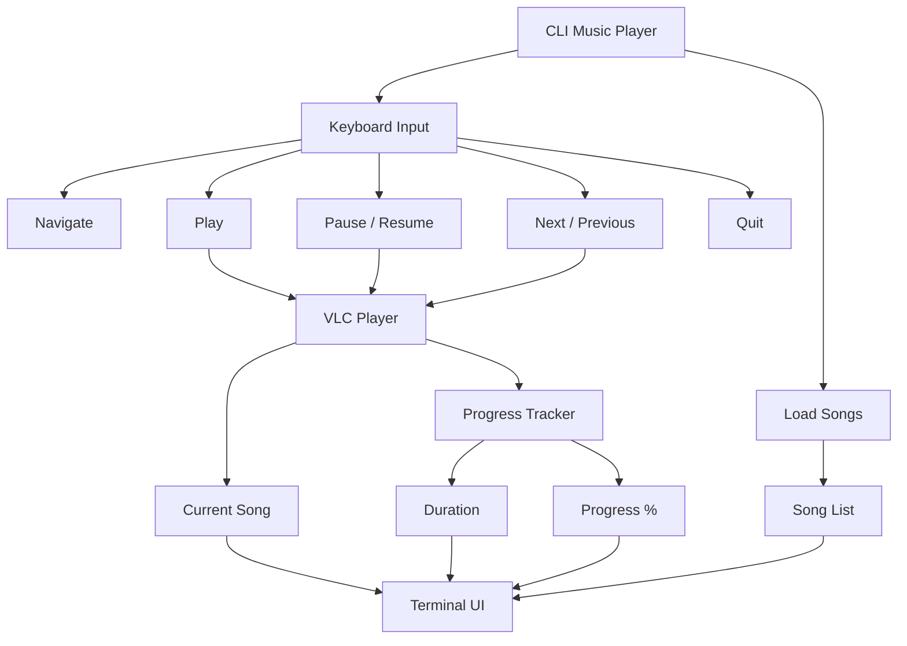

```mermaid
flowchart TD

    A["CLI Music Player"] --> B["Keyboard Input"]
    A --> C["Load Songs"]

    B --> D["Navigate"]
    B --> E["Play"]
    B --> F["Pause / Resume"]
    B --> G["Next / Previous"]
    B --> H["Quit"]

    E --> I["VLC Player"]
    F --> I
    G --> I

    I --> J["Current Song"]
    I --> K["Progress Tracker"]

    K --> L["Duration"]
    K --> M["Progress %"]

    C --> N["Song List"]

    N --> O["Terminal UI"]
    J --> O
    L --> O
    M --> O
```